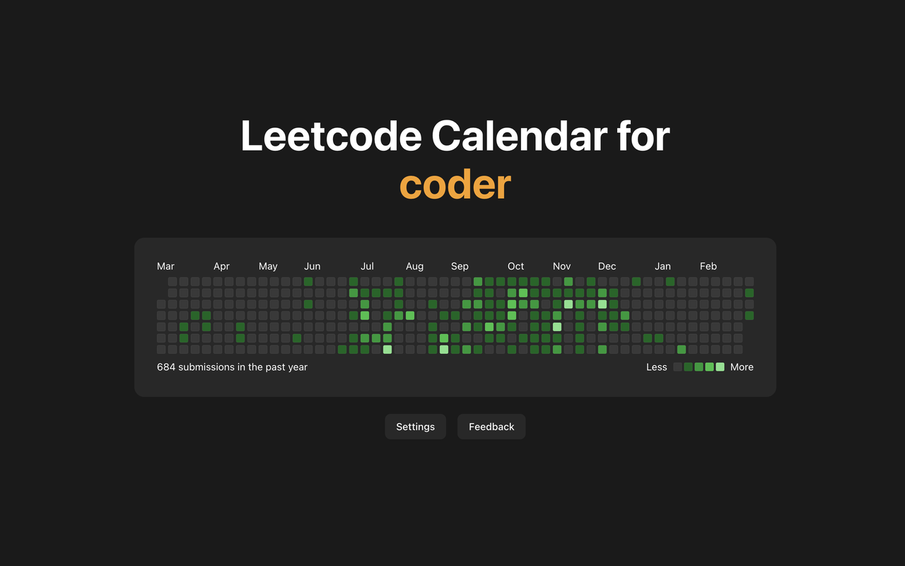

<h1 align="center">Leetcode Calendar</h1>

<h3 align="center">View your leetcode progress in a github-like calendar chart every time you open a new tab!</h3>

## Links

- Chrome Web Store: [Coming Soon]
- Firefox Browser Add-Ons: [Coming Soon]
- Privacy Policy: https://github.com/charlieweinberger/leetcode-calendar/blob/main/PRIVACY_POLICY.md

## How it works

Leetcode Calendar is a chrome extension that shows a minimalist view of your leetcode submission history every time you open a new tab. Users can choose which account to view simply by inputting their username, and can also choose which time range to view (either the current year or the previous 365 days). Users can also submit feedback for future suggestions/bugs.

## Tech Stack

- Frontend: React, Vite, TypeScript
- Styling: Tailwind CSS, shadcn/ui
- Backend: Leetcode GraphQL API, Chrome Storage API
- Email Feedback: Resend

## Future improvements

- More customization and interactivity (for example, theme settings and tooltips)
- More leetcode profile information
- Displaying information about multiple leetcode accounts
- A leaderboard to compete against others
- Similar chrome extensions for GitHub and WakaTime