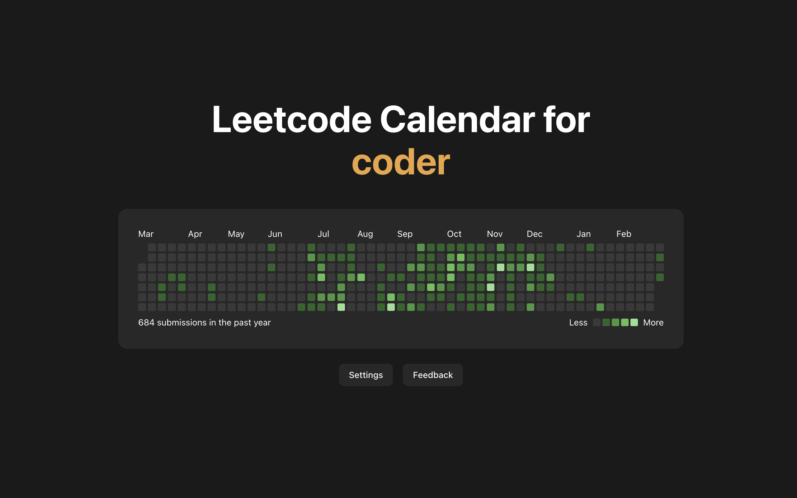

<h1 align="center">Leetcode Calendar</h1>

<h3 align="center">A chrome extension that displays your leetcode submission history as a heatmap/calendar every time you open a new tab!</h3>

## Links

- Chrome Web Store: [Coming Soon]
- Privacy Policy: https://github.com/charlieweinberger/leetcode-calendar/blob/main/PRIVACY_POLICY.md

## How it works

Leetcode Calendar is a chrome extension that shows a minimalist view of your leetcode submission history as a heatmap/calendar every time you open a new tab. You can choose which account to view simply by inputting your leetcode username, and you can choose which time range to view (either the current year or the previous 365 days). You can also submit feedback for future suggestions/bugs.

## Tech Stack

- Frontend: React, Vite, TypeScript
- Styling: Tailwind CSS, shadcn/ui
- Backend: Leetcode GraphQL API, Chrome Storage API
- Email Feedback: Resend

## Future improvements

- [ ] More leetcode profile statistics
- [ ] A weekly leaderboard
- [ ] More customization and interactivity (for example, theme settings and tooltips)
- [ ] Caching data so it doesn't fetch the API on every new tab
- [ ] Support for Firefox
- [ ] Expansion to GitHub and WakaTime