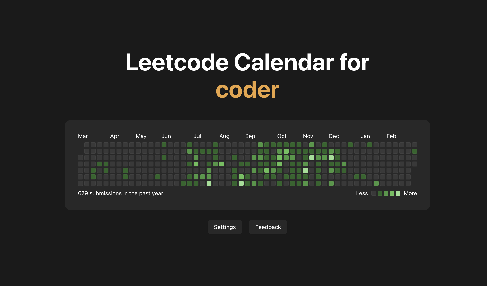

<h1 align="center">Leetcode Calendar Extension</h1>

<h3 align="center">View your leetcode progress in a github-like calendar when you open a new tab!</h3>

## Inspiration

Doing leetcode is a massive headache. Not only are the problems themselves difficult, the amount of time and effort programmers are expected to spend practicing leetcode problems on their own is daunting. I myself frequently forget or put off practicing leetcode. This problem led me to search for a better, easier way to stay motivated to do leetcode. I needed something that reminded me efficiently and often to work on leetcode instead of getting distracted elsewhere online.

## What it is

I've built a chrome extension that shows a minimalist view of your leetcode submission history. After inputting their leetcode username, users can view the number of leetcode submissions they have done in the past year. The more green, the more leetcode problems you've done, and the more likely you are to get that internship.

## Tech Stack

Frontend: React, Vite, TypeScript, Tailwind CSS
Backend: Chrome Storage API

## Challenges I ran into

First and foremost, I built this entire project in 6 hours, after driving around LA with friends for the entire day, so I was very limited on time and capabilities. I also had to learn how chrome extensions work for the first time, including configuring the extension to actually work and interacting with the chrome storage API. Finally, I had to write some *very* strange CSS to get the contribution graph to look good.

## Future improvements

There are many things that I didn't get to implement today that I will definitely be adding in the coming weeks. More customization and interactivity is a must - theme settings, tooltips, further Leetcode profile information, and displaying multiple leetcode accounts are all things I'd like to create. In addition, I plan on expanding this extension to GitHub contributions as well, and probably even other calendars such as WakaTime or Daily.dev.