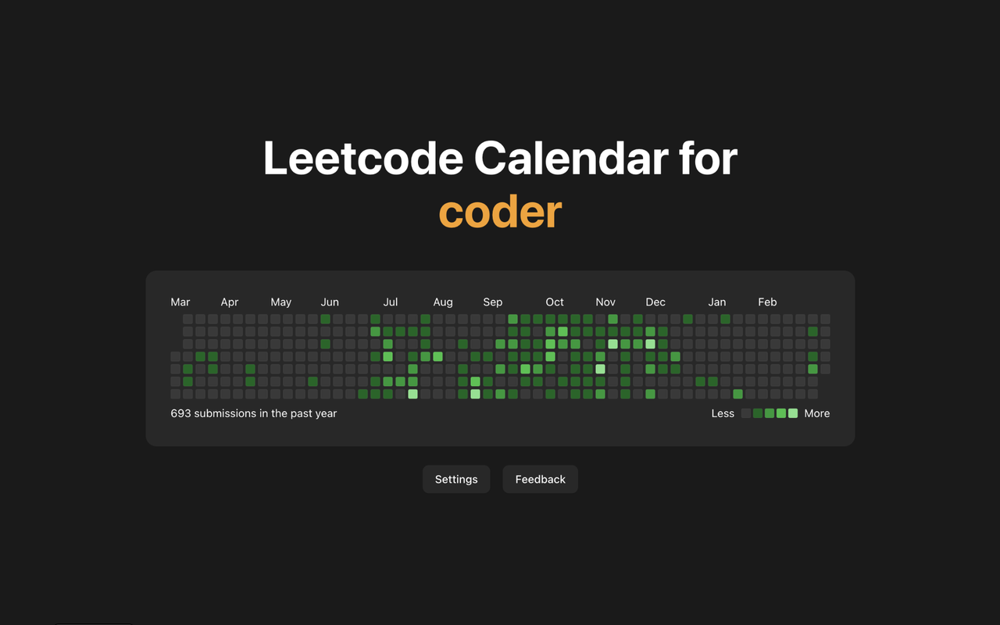

<h1 align="center">Leetcode Calendar</h1>

<h3 align="center">A web extension that displays your leetcode submission history as a heatmap/calendar every time you open a new tab!</h3>

## Links

- Chrome Web Store: https://chromewebstore.google.com/detail/leetcode-calendar/adakeigfgmhioifigjibpjdbgnanogkc
- Firefox Add-On: [Coming Soon!]
- Privacy Policy: https://github.com/charlieweinberger/leetcode-calendar/blob/main/PRIVACY_POLICY.md

## Description

Do you want to spend more time doing leetcode, but keep putting it off or forgetting to make time for it? If so, then this web extension is for you. Leetcode Calendar is a web extension that shows a minimalist view of your leetcode submission history as a heatmap/calendar every time you open a new tab. By reminding you of your leetcode progress every time you open a new tab, you'll never forget to do your daily leetcode problem to get that green square.

## Current Features

- Display data for any leetcode username
- Display tooltip for showing submissions for any day
- Toggle whether to view data in the current year (2025) or previous 365 days
- Toggle whether or not to view the title text
- Toggle whether to view a green colorway vs. orange colorway
- Submit user feedback within the extension

## Future Improvements

- [ ] Support for Firefox
- [ ] More leetcode profile statistics
- [ ] A weekly leaderboard
- [ ] More customization and interactivity
- [ ] Caching data so it doesn't fetch the API on every new tab
- [ ] Expansion to GitHub and WakaTime

## Tech Stack

- Frontend: React, Vite, TypeScript
- Styling: Tailwind CSS, shadcn/ui
- APIs: Leetcode GraphQL API, Resend (email), browser storage API

## Changelog

- Version 1.0.0: Added calendar, title, and settings for username and year
- Version 1.1.0: Added support for Chrome Web Store
- Version 1.1.1: Added Google Analytics
- Version 1.2.1: Added ability to toggle title on/off and colorway green/orange
- Version 1.3.0: Added tooltips, fixed bug in settings, removed Google Analytics
<!-- - Version 1.4.0: Added support for Firefox Add-Ons -->